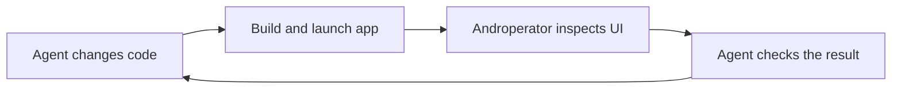
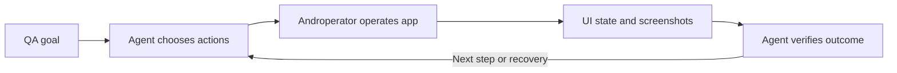
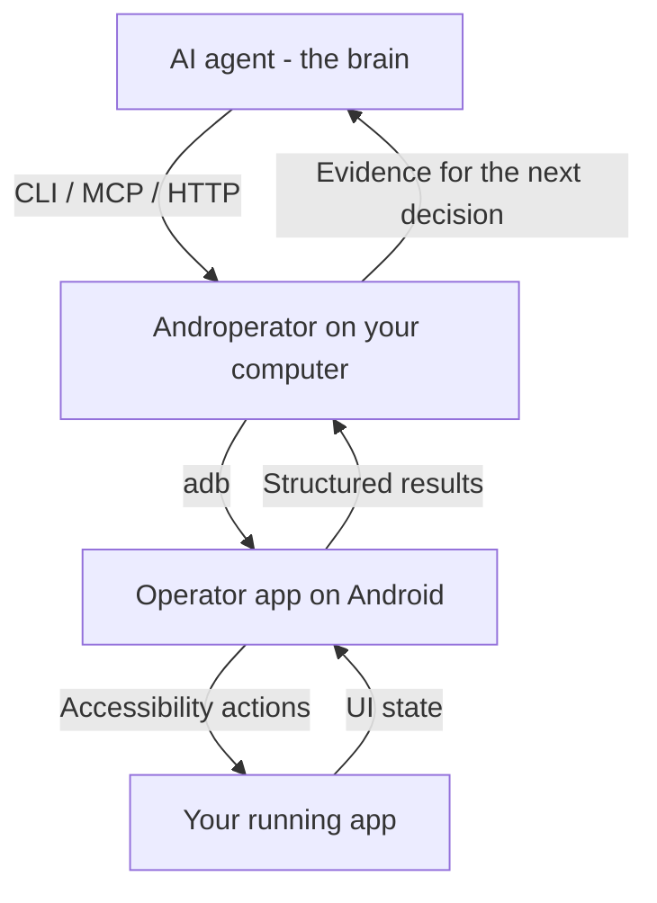

# Androperator


**Give your agent eyes and hands inside Android apps.**

Androperator connects AI agents to a running Android app on a phone or emulator.
Agents can inspect the UI, capture screenshots, tap controls, enter text, and
check the result through a predictable CLI, MCP server, or HTTP API.

Use it to **develop Android apps with an agent** and **automate QA verification**.
Your agent is the brain. Androperator is the hand that acts on the device and
brings back evidence.

[Quick Start](#quick-start) · [Documentation](https://docs.androperator.com/) · [GitHub](https://github.com/androperator/androperator)

## Develop with eyes on the app

Give your coding agent more than source code. Let it explore the running app,
reproduce a UI bug, and inspect the screen after a fix. Screenshots show what
users see; UI snapshots expose the accessible controls the agent can act on.



Ask your agent: **“Reproduce the settings bug, fix it, then use Androperator to
check the updated screen on the emulator.”** Your development tools build and
install the app; Androperator supplies observation and interaction.

## Automate QA verification

Have an agent exercise a user flow on a real Android UI, then compare the
observed state with the expected outcome. Use taps, text entry, scrolling,
snapshots, screenshots, and recordings to investigate failures and keep evidence.



Ask your agent: **“Check that changing the display preference survives closing
and reopening the app. Capture evidence if it fails.”** A completed action is
one step; the agent checks the resulting state before declaring the flow passed.

## How it works

The agent plans and interprets results. Androperator executes explicit Android
actions and returns structured evidence. App-specific decisions and recovery
stay with the agent.



The Node.js CLI runs on your computer. The Operator Android app uses
accessibility to inspect and interact with apps on a connected phone or emulator.
Screenshots capture the device display. No app-specific SDK integration is
required; UI hierarchy visibility depends on what the app exposes through
Android accessibility.

- **Observe:** XML UI snapshots, compact JSON hierarchies, node queries, screenshots, and recordings.
- **Act:** open apps, tap, type, scroll, swipe, and drag.
- **Verify:** inspect returned state and explicit errors, then decide whether to continue, recover, or stop.

Reusable skills can capture workflows your agent has learned. They are optional;
an agent can drive the documented API directly.

<a id="install"></a>

## Quick Start

One command installs the CLI, downloads and verifies the latest Androperator
Operator Android app when needed, and helps prepare an Android device for your agent.

Tell your agent to:

```text
Read https://androperator.com/skill.md and get me set up with Androperator.
```

Install Androperator on macOS/Linux:

```bash
curl -fsSL https://androperator.com/install.sh | bash
```

Or, with Node.js 24+ and Android platform-tools already installed:

```bash
npm install -g androperator
androperator install
```

No Android device handy? Have Androperator create a Google Play equipped
Android emulator.

```bash
androperator emulator provision
```

Emulator provisioning needs a supported host and Android SDK emulator tools.
For a physical phone, enable USB debugging and authorize the computer.
Follow the [setup guide](docs/setup.md) for prerequisites and permissions, and
[emulator guidance](https://docs.androperator.com/api/serve/#endpoint-post-android-provision-emulator) for host requirements.

Androperator has comprehensive documentation, setup guides, and API references
at [docs.androperator.com](https://docs.androperator.com/).

### Try the observation loop

Choose a device, check readiness, then inspect an app:

```bash
androperator devices
androperator doctor --device <device_serial>
androperator open com.android.settings --device <device_serial>
androperator snapshot --compact --device <device_serial>
androperator screenshot --path /tmp/android-screen.png --device <device_serial>
```

The compact snapshot returns a bounded JSON hierarchy. Use the observed text
or resource IDs to choose an action, then inspect again. Pass `--device`
explicitly when multiple targets are connected. These commands use the release
Operator; for a local debug APK, add
`--operator-package com.androperator.operator.dev`.

## Go deeper

- [Quickstart](docs/quickstart.md) - your first device interaction.
- [Setup](docs/setup.md) - host requirements and Android permissions.
- [API overview](docs/api/overview.md) - CLI, HTTP, actions, and results.
- [MCP server](docs/api/mcp.md) - connect an agent through MCP.
- [Recording](docs/api/recording.md) - capture a flow and its evidence.
- [Troubleshooting](docs/troubleshooting/operator.md) - diagnose setup and runtime failures.

For agents, start with [agent guidance](https://androperator.com/agents/) and the
[technical documentation index](https://androperator.com/llms.txt).

Androperator was formerly known as Clawperator. See the
[migration guide](docs/migration-to-androperator.md) and [release notes](CHANGELOG.md).

## License

[Apache 2.0](LICENSE). Built by [@chrismlacy](https://x.com/chrismlacy),
with help from ever-nondeterministic agents.

Copyright (c) 2026 Action Launcher Pty Ltd
