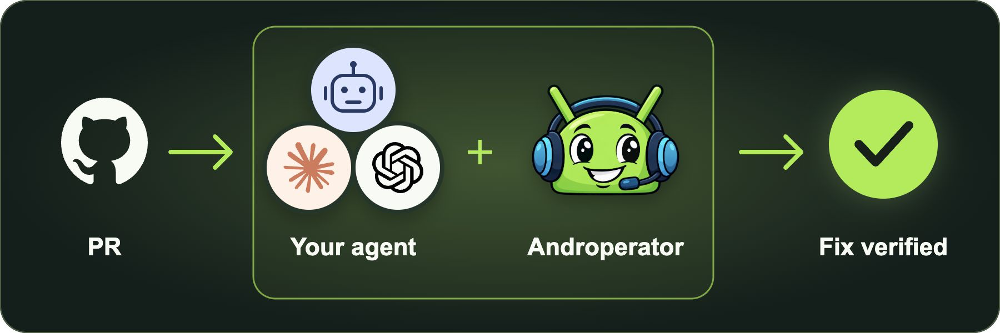
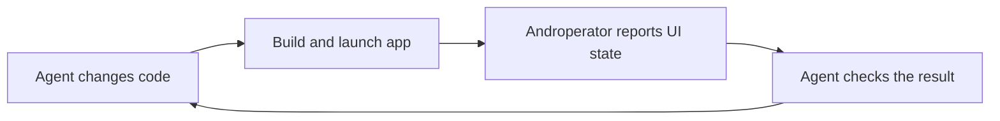
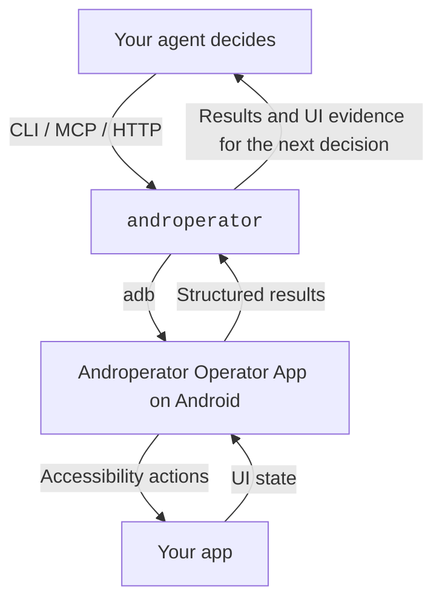

# Androperator


**Your agent decides. Androperator executes and reports.**

**Free and fully open source. Licensed under [Apache 2.0](https://github.com/androperator/androperator/blob/main/LICENSE).**

Androperator (“Android Operator”) gives your agent visibility and control inside
Android apps.
[UI snapshots](https://docs.androperator.com/api/snapshot/),
[screenshots](https://docs.androperator.com/api/actions/#action-take-screenshot),
taps, text entry, and more, through a deterministic API.

The loop is simple. Your agent chooses a command. Androperator executes it on
a device or emulator and reports the result. Your agent can [inspect the updated
screen](https://docs.androperator.com/api/snapshot/), check what changed, and choose its next move. That's how a plan becomes
work you can see in the running app.

Connect through the [CLI](https://docs.androperator.com/api/cli/),
[MCP server](https://docs.androperator.com/api/mcp/), or
[HTTP API](https://docs.androperator.com/api/serve/). Put your coding agent to work
building features, turning vague bug reports into repeatable steps, and checking
fixes with evidence to back up its conclusions.

[Quick Start](#quick-start) · [Documentation](https://docs.androperator.com/) · [GitHub](https://github.com/androperator/androperator)

<a id="why"></a>
<a id="automate-qa-verification"></a>
<a id="put-your-qa-checklist-to-work"></a>

<a id="give-every-fix-a-first-qa-pass"></a>

## Give every PR an automated QA pass

Pull request ready? Let your agent try the fix in the running app.
Androperator gives it the controls and visibility to replay the bug and check
what changed. You get a QA report with screenshots before you review.

Ask your agent: **“Check the display-setting fix against these reproduction
steps. Verify that the preference survives closing and reopening the app.
Write a report with pass/fail results, screenshots, and anything you couldn't
verify.”**



Your agent reports what passed, what failed, and what it couldn't verify,
with evidence for you to review. Run the same checks again for the next fix,
or give it your broader QA checklist.

<a id="turn-it-sometimes-breaks-into-steps-you-can-follow"></a>

## Turn “it sometimes breaks” into a proper bug report

“The appearance setting is broken.” That's a starting point, but it's hard
to fix a bug you can't reproduce. Ask your agent to investigate in the running
app, try the likely paths, and narrow down what triggers it. Androperator
runs the requested actions and observations, giving the agent fresh evidence
to decide which path to try next.

Put Androperator on the case:

```text
Use `androperator` to investigate a user bug report: "The appearance setting is broken."
```

The agent will try and output reliable steps to reproduce the bug for handoff
for the ticket. If the agent can't reproduce the bug, it can record what it
tried and what's still unknown.

<a id="develop-with-eyes-on-the-app"></a>

<a id="give-your-coding-agent-the-running-app"></a>

## Give your coding agent eyes and hands

A fix can look right in code and still be wrong on screen. Let your agent open
the app, reproduce the bug, and check its work where you'll actually use it.
Screenshots show the layout; [UI snapshots](https://docs.androperator.com/api/snapshot/)
give the agent controls to target.

Ask your agent: **“Reproduce the settings bug, fix it, then use Androperator to
check the updated screen on the emulator.”**



Your development tools build and install the app. Androperator lets your agent
interact with it and inspect the result. That feedback brings the running app
into the coding loop: change the code, try it on the device, see what needs work.

## How it works

Androperator connects your agent's decisions to what's happening on the device.
It validates and executes explicit commands, reports action results and errors,
and exposes the UI through [snapshots](https://docs.androperator.com/api/snapshot/)
and [screenshots](https://docs.androperator.com/api/actions/#action-take-screenshot). Your agent uses that
feedback to plan the next step, check an outcome, or investigate a failure.



The Node.js CLI runs on your computer. The Androperator Operator App uses
accessibility to inspect and interact with apps on a connected phone or emulator.
Screenshots capture the device display. No app-specific SDK integration is
required; UI hierarchy visibility depends on what the app exposes through
Android accessibility.

- **Observe:** [XML UI snapshots and compact JSON hierarchies](https://docs.androperator.com/api/snapshot/), [node queries](https://docs.androperator.com/api/actions/#action-query-ui), [screenshots](https://docs.androperator.com/api/actions/#action-take-screenshot), and [recordings](https://docs.androperator.com/api/recording/).
- **Act:** open apps, tap, type, scroll, swipe, and drag.
- **Report:** structured action results and explicit errors give your agent feedback it can check alongside UI observations.

Your agent can use the API directly or follow a reusable skill for a familiar
workflow. Either way, the decisions stay with your agent.

<a id="install"></a>

## Quick Start

Start by asking your agent to handle setup:

```text
Read https://androperator.com/skill.md and get me set up with Androperator.
```

Prefer the terminal? On macOS or Linux, this installs the CLI and helps set up
the Androperator Operator App on your Android device:

```bash
curl -fsSL https://androperator.com/install.sh | bash
```

Or, with Node.js 24+ and Android platform-tools already installed:

```bash
npm install -g @androperator/cli
androperator install
```

No phone handy? Create an Android emulator with Google Play:

```bash
androperator emulator provision
```

Emulator provisioning needs a supported host and Android SDK emulator tools.
For a physical phone, enable USB debugging and authorize the computer.
Follow the [setup guide](docs/setup.md) for prerequisites and permissions, and
[emulator guidance](https://docs.androperator.com/api/serve/#endpoint-post-android-provision-emulator) for host requirements.

<a id="try-the-observation-loop"></a>

### Take a look around

Check your device is ready, open Settings, and grab a snapshot and screenshot:

```bash
androperator devices
androperator doctor --device <device_serial>
androperator open com.android.settings --device <device_serial>
androperator snapshot --compact --device <device_serial>
androperator screenshot --path /tmp/android-screen.png --device <device_serial>
```

The [compact snapshot](https://docs.androperator.com/api/snapshot/) returns a bounded JSON hierarchy. Use the observed text
or resource IDs to choose an action, then inspect again. Pass `--device`
explicitly when multiple targets are connected. These commands use the release
Androperator Operator App; for a local debug APK, add
`--operator-package com.androperator.operator.dev`.

<a id="go-deeper"></a>

## Keep going

- [Quickstart](docs/quickstart.md) - your first device interaction.
- [Setup](docs/setup.md) - host requirements and Android permissions.
- [API overview](docs/api/overview.md) - CLI, HTTP, actions, and results.
- [MCP server](docs/api/mcp.md) - connect an agent through MCP.
- [Recording](docs/api/recording.md) - capture a flow and its evidence.
- [Troubleshooting](docs/troubleshooting/operator.md) - diagnose setup and runtime failures.

Androperator was formerly known as Clawperator. See the
[migration guide](docs/migration-to-androperator.md) and [release notes](CHANGELOG.md).

## License

[Apache 2.0](LICENSE). Built by [@chrismlacy](https://x.com/chrismlacy),
with help from ever-nondeterministic agents.

Copyright (c) 2026 Action Launcher Pty Ltd
