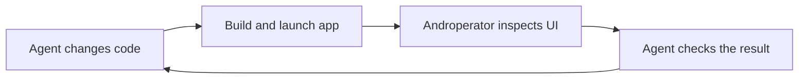
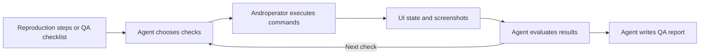
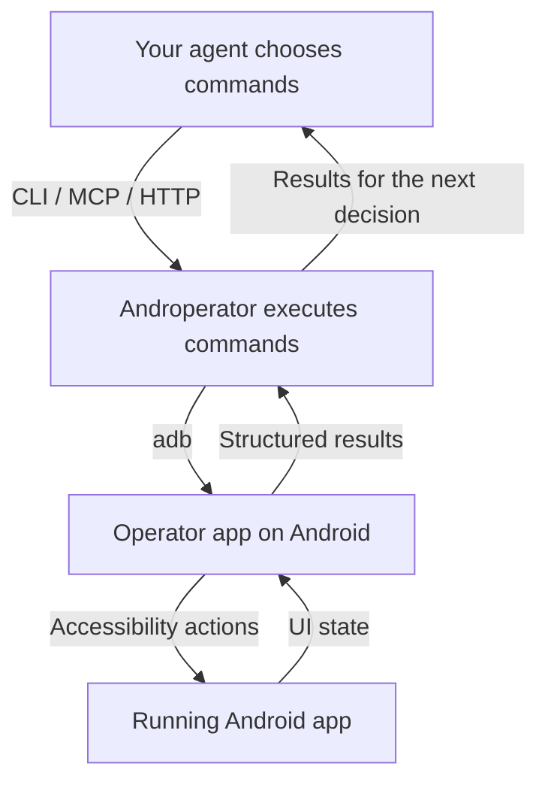

# Androperator


**Your agent calls the shots. Androperator handles Android.**

Androperator is a deterministic API for Android. Your agent decides what to do;
Androperator executes its commands on a phone or emulator and returns the results.
Tap a button, enter text, read the screen, take a screenshot. Your agent gets
the feedback it needs to choose the next step.

Use it to put your coding agent to work in the running app: turn vague bug
reports into repeatable steps, check fixes, and report what passed or failed. You set the goal. Your agent makes the decisions.
Androperator provides reliable device control through a CLI, MCP server, or HTTP API.

[Quick Start](#quick-start) · [Documentation](https://docs.androperator.com/) · [GitHub](https://github.com/androperator/androperator)

<a id="develop-with-eyes-on-the-app"></a>

## Give your coding agent the running app

A fix can look right in code and still be wrong on screen. Let your agent open
the app, reproduce the bug, and check its work where you'll actually use it.
Screenshots show the layout; UI snapshots give the agent controls to target.

Ask your agent: **“Reproduce the settings bug, fix it, then use Androperator to
check the updated screen on the emulator.”**



Your development tools build and install the app. Androperator runs the device
commands your agent chooses and returns what happened. The agent uses those
results to decide whether the fix holds up.

## Turn “it sometimes breaks” into steps you can follow

“The display setting keeps resetting.” That's a starting point, but it's hard
to fix a bug you can't reproduce. Ask your agent to investigate in the running
app, try the likely paths, and narrow down what triggers it. Androperator
executes the commands and supplies the screen state and screenshots.

Ask your agent: **“Investigate this report: ‘The display setting keeps resetting.’
If you can reproduce it, repeat the flow to confirm it and write numbered steps
with the starting conditions, expected result, actual result, and screenshots.”**

The useful output is a reproduction another person can follow. If the agent
can't reproduce the bug, have it record what it tried and what's still unknown.

<a id="automate-qa-verification"></a>
<a id="put-your-qa-checklist-to-work"></a>

## Give every fix a first QA pass

A fix is ready for a first check as soon as the updated app is running. Have
your agent replay the reproduction steps, compare what happens with what
should happen, and write up the result. Use the same approach for your regular
QA checklist.

Ask your agent: **“Check the display-setting fix against these reproduction
steps. Verify that the preference survives closing and reopening the app.
Write a report with pass/fail results, screenshots, and anything you couldn't
verify.”**



A successful tap doesn't prove a test passed. Your agent judges the observed
result and produces the report: what it tested, what passed, what failed, and
what still needs attention. You get a first line of automated verification
with evidence to review.

## How it works

The division of labor is simple: your agent owns the plan, Androperator runs
the commands. Androperator validates explicit actions, executes them on Android,
and returns structured results or errors. Your agent interprets the response
and decides what to try next, including when something goes wrong.



The Node.js CLI runs on your computer. The Operator Android app uses
accessibility to inspect and interact with apps on a connected phone or emulator.
Screenshots capture the device display. No app-specific SDK integration is
required; UI hierarchy visibility depends on what the app exposes through
Android accessibility.

- **Observe:** XML UI snapshots, compact JSON hierarchies, node queries, screenshots, and recordings.
- **Act:** open apps, tap, type, scroll, swipe, and drag.
- **Check the result:** your agent reads the returned state and errors, then decides whether to continue, recover, or stop.

Your agent can use the API directly or follow a reusable skill for a familiar
workflow. Either way, the decisions stay with your agent.

<a id="install"></a>

## Quick Start

Start by asking your agent to handle setup:

```text
Read https://androperator.com/skill.md and get me set up with Androperator.
```

Prefer the terminal? On macOS or Linux, this installs the CLI and helps set up
the Operator app on your Android device:

```bash
curl -fsSL https://androperator.com/install.sh | bash
```

Or, with Node.js 24+ and Android platform-tools already installed:

```bash
npm install -g androperator
androperator install
```

No phone handy? Create an Android emulator with Google Play:

```bash
androperator emulator provision
```

Emulator provisioning needs a supported host and Android SDK emulator tools.
For a physical phone, enable USB debugging and authorize the computer.
Follow the [setup guide](docs/setup.md) for prerequisites and permissions, and
[emulator guidance](https://docs.androperator.com/api/serve/#endpoint-post-android-provision-emulator) for host requirements.

<a id="try-the-observation-loop"></a>

### Take a look around

Check your device is ready, open Settings, and grab a snapshot and screenshot:

```bash
androperator devices
androperator doctor --device <device_serial>
androperator open com.android.settings --device <device_serial>
androperator snapshot --compact --device <device_serial>
androperator screenshot --path /tmp/android-screen.png --device <device_serial>
```

The compact snapshot returns a bounded JSON hierarchy. Use the observed text
or resource IDs to choose an action, then inspect again. Pass `--device`
explicitly when multiple targets are connected. These commands use the release
Operator; for a local debug APK, add
`--operator-package com.androperator.operator.dev`.

<a id="go-deeper"></a>

## Keep going

- [Quickstart](docs/quickstart.md) - your first device interaction.
- [Setup](docs/setup.md) - host requirements and Android permissions.
- [API overview](docs/api/overview.md) - CLI, HTTP, actions, and results.
- [MCP server](docs/api/mcp.md) - connect an agent through MCP.
- [Recording](docs/api/recording.md) - capture a flow and its evidence.
- [Troubleshooting](docs/troubleshooting/operator.md) - diagnose setup and runtime failures.

For agents, start with [agent guidance](https://androperator.com/agents/) and the
[technical documentation index](https://androperator.com/llms.txt).

Androperator was formerly known as Clawperator. See the
[migration guide](docs/migration-to-androperator.md) and [release notes](CHANGELOG.md).

## License

[Apache 2.0](LICENSE). Built by [@chrismlacy](https://x.com/chrismlacy),
with help from ever-nondeterministic agents.

Copyright (c) 2026 Action Launcher Pty Ltd
